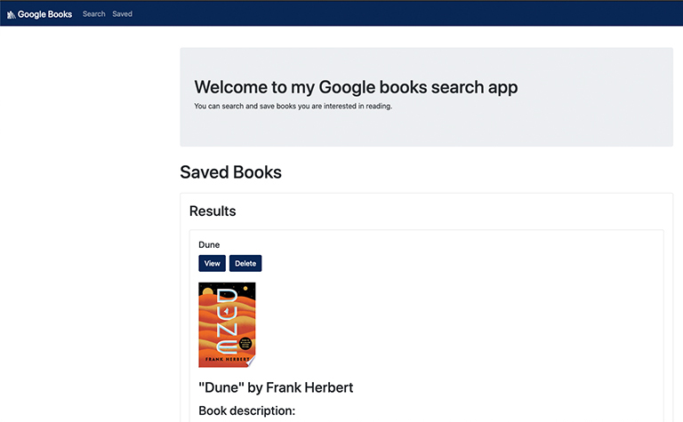

# [My Bookshelves](https://jjh-bookshelves.herokuapp.com/)

    
    
    
    

    
    

## Application Descrition

An app that helps you find the next book you want to read.

## Application Demo

To watch a video of the application being fully demo'd please use this link: [Application Demo](https://drive.google.com/file/d/1eKCHhFoogO5SPak3iPoDMOGkfSjoisBb/view).

## Technologies Used

  
  
  
  
  
  
  
  
  
  

## Resources

[Shields.io](https://shields.io/)

[React Icons](https://react-icons.github.io/react-icons/)

[Screencastify](https://www.screencastify.com/)

## Workflow

I think at a different time, I would have had a better time working on this assignment. Since it was given to us right before our final project, it was more of a back burner than top priority. Our instructor did a in-depth demos of how to build it in our office hours. It was going to be similar to our final project. This proved useful because it helped me better understand React.

The first thing I did was install a two React apps: client & server. Then I removed all the code I could. I had some issues whenever I removed the service worker that I just left it there.

The next thing to do was build my components and pages for my app. I tried to recolor my header with a SASS variable. I didn't need to but I wanted to see if I could do it. I also had wanted to test some React Icons that I had seen used in a video. This helped me use them in my final project too.

Building out the API call with the provided data proved to be a very interesting part of this assignment. Making sure all the data got passed correctly proved to be a challenge for me but it was an interesting challenge. It also gave me a better understanding of state and how that works.

Once I was able to get things working with the provided data, I started to try and figure out how to use Google Books' API. Making the API call was difficult but then trying to pass the data to my other components proved even harder for me. I couldn't find a specific example of what I was wanting to do. I ended up working on it with a friend and we were able to get my data to pass from when I'd "save" a book to the "Saved Books" page. It involved a lot of console logs and drilling into the objects. But it feels good to be DONE! Well, it did till I realized I needed to make my Heroku connection to my DB. Always one more thing!
